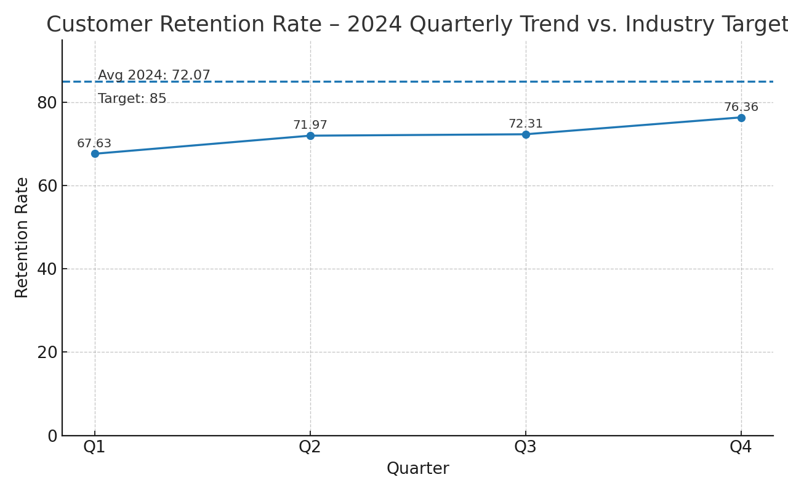
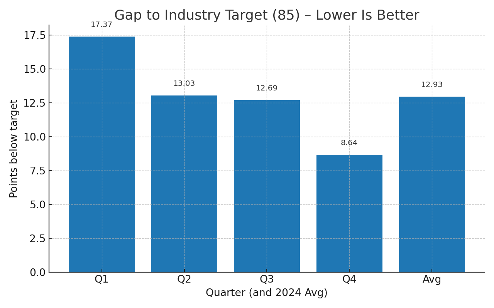

Commit to retention analysis
# E-commerce Customer Retention – 2024 Analysis (PR Package)

**Contact:** 24f2005647@ds.study.iitm.ac.in

This pull request adds code, charts, and a data story to investigate the company's declining customer loyalty.
The analysis uses 2024 quarterly customer retention rates and benchmarks them against the industry target.

## Dataset

| Quarter | Retention Rate |
|---------|----------------|
| Q1      | 67.63          |
| Q2      | 71.97          |
| Q3      | 72.31          |
| Q4      | 76.36          |
| **Average** | **72.07** |

**Industry Target:** 85

## Key Findings

1. **Upward Trend, Still Under Target:** Retention improved from **67.63** (Q1) to **76.36** (Q4), yet the **2024 average is 72.07**, which is **12.93 points below** the industry target of **85**.
2. **Closing but Persistent Gap:** Even in Q4, retention is **8.64 points below target**, implying additional structured interventions are required.
3. **Sustained Gains Needed:** Quarter-over-quarter growth is present but not at a pace that will reach 85 without targeted programs.

## Business Implications

- **Revenue at Risk:** Lower retention increases acquisition costs and reduces customer lifetime value (CLV). Budgeting for FY25 should assume headwinds unless retention programs accelerate.
- **Competitive Pressure:** Falling short of the 85 benchmark risks market share loss in segments where switching costs are low.
- **Prioritization Needed:** Investment should prioritize post‑purchase experience, lifecycle marketing, and loyalty mechanics where ROI is highest.

## Recommendations – Implement Targeted Retention Campaigns

To reach the target of **85**, we recommend a focused program backed by experiments and measurement:

**1) Segmented Lifecycle Journeys**
- Build cohorts by recency/frequency/monetary (RFM), product category, discount sensitivity, and support history.
- Trigger personalized nudges at moments of risk (e.g., 30/60/90‑day inactivity) with calibrated offers.

**2) Value-based Loyalty & Benefits**
- Tiered loyalty program with experiential perks (priority support, early access) over blanket discounts.
- Reward progress (stamps/credits) and attach perks to high-margin categories.

**3) Post‑Purchase Experience**
- Proactive order updates, easy returns, “how to use” content, and review requests to reinforce value.
- Rapid remediation for defects and SLA-backed support for top tiers.

**4) Win‑back & Churn Prevention**
- Predict churn from inactivity, browse behavior, and CSAT; intercept with targeted offers or content.
- Dedicated win‑back journeys for 90+ day lapsed users; escalate incentive by predicted CLV.

**5) Always‑on Experimentation**
- A/B test offer level, channel mix (email, SMS, WhatsApp, push), and send-time optimization.
- Track north-star: retention, repeat rate, and incremental profit, not only open/click.

**6) Measurement & Governance**
- Weekly retention dashboard, cohort survival curves, and variance decomposition (category, region, acquisition source).
- Define guardrails for discount burn and CAC payback.

## Visualizations

- Trend vs Target: `charts/retention_trend.png`  
- Gap to Target: `charts/retention_gap_to_target.png`




## How to Run

```bash
# 1) Create and activate a virtual environment (optional)
python -m venv .venv
source .venv/bin/activate  # Windows: .venv\Scripts\activate

# 2) Install requirements
pip install -r requirements.txt

# 3) Run the analysis (generates charts in charts/ and summary.json in reports/)
python src/analyze_retention.py
```

## Files Included in This PR

- `data/retention_2024.csv` – Source data.
- `src/analyze_retention.py` – Analysis and visualization script.
- `charts/retention_trend.png` – Trend vs benchmark.
- `charts/retention_gap_to_target.png` – Gap to target.
- `reports/summary.json` – Machine‑readable key stats (generated).
- `README.md` – Data story and instructions.
- `requirements.txt` – Dependencies.
- `.gitignore` – Common Python ignores.

---

_Prepared by: 24f2005647@ds.study.iitm.ac.in_
